# bamazon Node.js & MySQL


## Overview

This is an Amazon-like storefront Command Line Interface app (CLI). The app takes in orders from customers and depletes stock from the store's inventory. It tracks product sales across the store's departments and then provides a summary of the highest-grossing departments in the store.  The `index.js` module invokes the customer, manager or supervsior modules or you can load those modules individually using `bamazonCustomer.js`, `bamazonManager.js` or `bamazonSupervisor`.  Each of these will allow you to perform functions as that user type until you select `quit` to end.

As fields are enetered using `inquirer`, I use the validate method to ensure that the fields entered are appropriate and match (e.g. must be a valid department ID when adding a product, must be valid number etc).

## Links
* [Live Portfolio Page](https://plinck.github.io/My-Portfolio/)
* [GitHub for this](https://github.com/plinck/bamazon)


## Instructions to use/test

- Clone the repo to your machine since it is a console application
- Go into the `server/` directory in the repo as that is where all the CLI code and config is
- npm install (to install dependecies in package.json)
- Create a mySQL database connecton in SQLWorkbench with user id `plinck` and password `password` that has access to DB
- Create the database used in these modules using the SQL files --- `server/SQL/bamazon_db.sql`. Then seed data with `server/SQL/bamazon_data.sql`
- Run `node index` from the `server` directory - all sub menus are called from that for customer, manager and supervisor roles.  Alternatively, you can load those modules individually using `bamazonCustomer.js`, `bamazonManager.js` or `bamazonSupervisor`.
- If you want to use JAWS DB you will need a .env with my Heroku DB URL in it.  I will give it to you if you need it.

## Technologies Used

- [x] Javascript
- [x] SQL (JawsDB on heroku and Local mySQL DB)
- [x] Node.js, inquirer, async, dotenv, mysql

## Screenshots
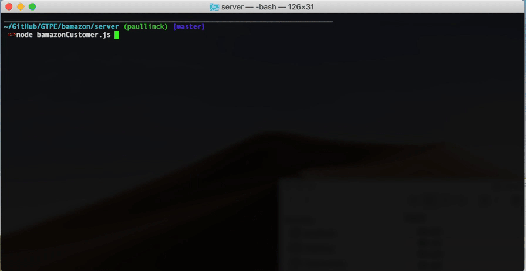
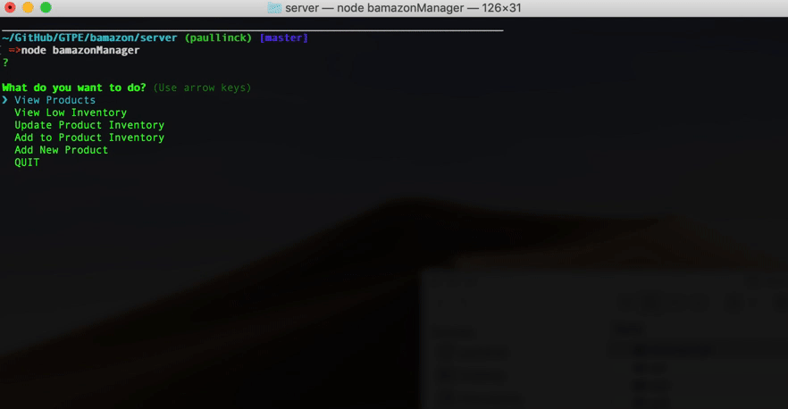
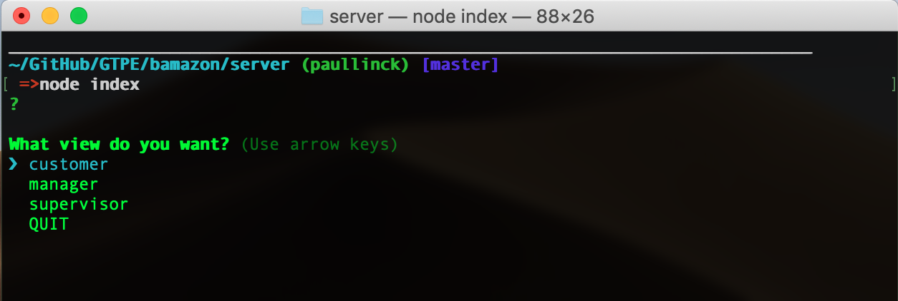
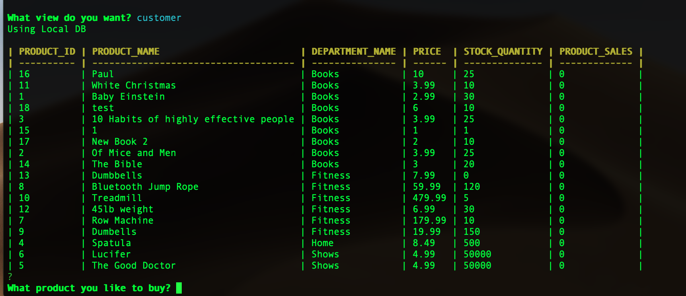
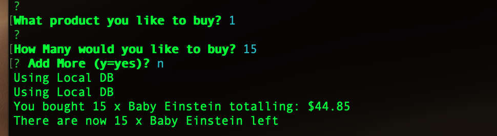
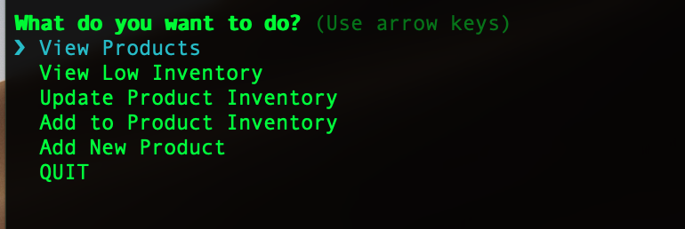
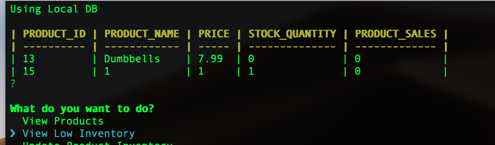
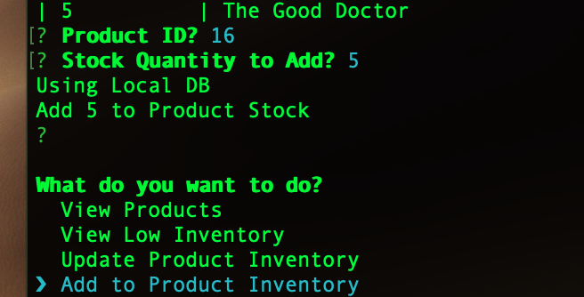
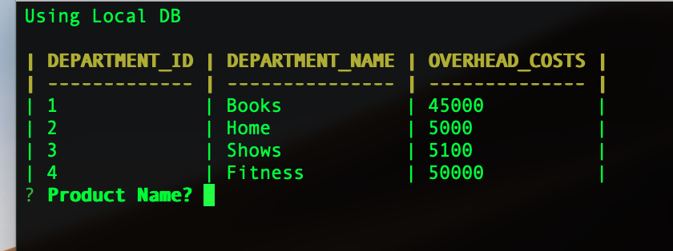
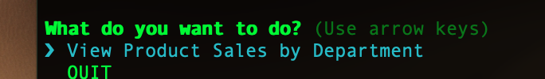
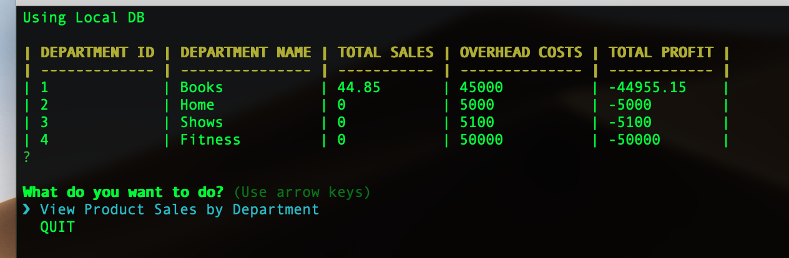

## Design


### Notes

- I used promises and callbacks in a several ways to demonstrate the differences -- async/await, try/catch and standard (.then, .catch). In addition I used standard callbacks.  I wanted to show all the different ways these things could be done.  

### Main Menu

Main menu just displays customer, manager or supervisor to choose your roles.  

### Customer View

1. `products` table

  ```sql
   CREATE TABLE products (
    product_id     INT AUTO_INCREMENT NOT NULL,
    department_id  INT NOT NULL,
    product_name   VARCHAR(100) NOT NULL,
    price          DECIMAL(8, 2) NOT NULL,
    stock_quantity INT NOT NULL,
    product_sales  DECIMAL(8, 2) NOT NULL DEFAULT 0,
    PRIMARY KEY (product_id)
  );
  ```

2. First, the app displays all of the items available for sale complete price, stock, id and name.  I wrote a customer render function `render.js` to output the table in a pretty manners.  I made it generic so it can be used on the results of any query.

3. It then prompts the user with two messages.
   - The first asks for the ID of the product they would like to buy.  I validate this as existing product.
   - The second message asks how many units of the product they would like to buy.  Validate this as number.

4. Once they have placed the order, it checks if the store has enough of the product to meet the request.
   - If not, the app logs a message indicated not enough stock, and then prevent the order from going through.

5. However, if the store _does_ have enough of the product, the app fulfills the order.
   - It updares database to reflect the remaining quantity (stock qty - purchased qty)
   - It updates the total sales for this product with the additional revenue for this order
   - After that completes successfully the app shows the customer the total cost of their purchase and how many are left in stock.

- - -

### Manager View

* `View Products for Sale` lists every available item: the item IDs, names, prices, department and quantities.

* `View Low Inventory` lists all items with an inventory count lower than **5**.

* `Update Inventory` displays products and then a prompt that lets the manager update the quanity of any item currently in the store.  You can make it higher or lower in case it was spoiled or something and to make testing easier.   So it does not force you to just add to the inventory, you can make it whatever you want.  This is handy for handling any situation including testing the low inventory function. 

* `Add to Inventory` displays products and then a prompt that lets the manager update the quanity of any item currently in the store.  Then you can ADD to the stock for that product.  I implemented add and update for completeness.


* `Add New Product` allows the manager to add a new product to the store.
  
* Validattion is done on all input fields to ensure database integrity is maintained

- - -

### Supervisor View

1. `departments` table.
  ```sql
  CREATE TABLE departments (
    department_id   INT AUTO_INCREMENT NOT NULL,
    department_name VARCHAR(30) NOT NULL,
    overhead_costs  DECIMAL(8, 2) NOT NULL,
    PRIMARY KEY (department_id)
  );
  ```

2. When a customer purchases anything from the store, the price of the product multiplied by the quantity purchased is added to the product's product_sales column.  _This is noted in customer section_.

3. `View Product Sales by Department` displays a summarized table in their terminal/bash window. Use the table below as a guide.

| department_id | department_name | over_head_costs | product_sales | total_profit |
| ------------- | --------------- | --------------- | ------------- | ------------ |
| 01            | Electronics     | 10000           | 20000         | 10000        |
| 02            | Clothing        | 60000           | 100000        | 40000        |

1. The `total_profit` column is calculated on the fly using the difference between `over_head_costs` and `product_sales`. `total_profit` is not stored in any database.

   * **NOTE**: I wrote a custom `render` function that displays results from any query in a pretty format.  I didnt check for and NPM package since I forgot, but I didnt like the npm package output anyway so I made a better one.  It taught me some techniques that are gonna come in handy later

## To Do

- add images and animanted GIFs to the readme.