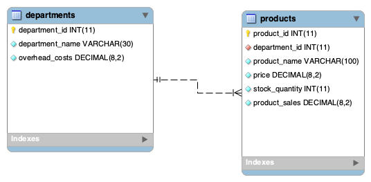

# bamazon Node.js & MySQL

## Overview

This is an Amazon-like storefront Command Line Interface app (CLI). The app takes in orders from customers and depletes stock from the store's inventory. As a bonus, it tracks product sales across the store's departments and then provides a summary of the highest-grossing departments in the store.

## Instructions

- You must clone the repo to your machine since it is a console application
- Then npm install dependencies
- Create the database using the SQL files --- `server/bamazon_db.sql` and seed data with `server/bamazon_data.sql`
- Then run `node index` from the `server` directory - all sub menus are called from that for customer, manager and supervisor
- Create a mySQL database connecton with user id `plinck` and password `password` that has access to DB
- If you want to use JAWS DB you will need a .env with my Heroku DB URL in it.  I will give it to you if you need it.

## Technologies Used

- [x] Javascript
- [x] SQL (JawsDB on heroku and Local mySQL DB)
- [x] Node.js, inquirer, async, dotenv, mysql

## Screenshots


## Design


### Notes

- I used promises in a several ways to demonstrate the differences -- async/await, try/catch and standard (.then, .catch).  I am not convinved on what the **best** way is in each sitaution but working on it.

### Part #1: Customer View

1. Create a MySQL Database called `bamazon`.

2. `products` table (with 10 product examples)

  ```sql
   CREATE TABLE products (
    product_id     INT AUTO_INCREMENT NOT NULL,
    department_id  INT NOT NULL,
    product_name   VARCHAR(100) NOT NULL,
    price          DECIMAL(8, 2) NOT NULL,
    stock_quantity INT NOT NULL,
    product_sales  DECIMAL(8, 2) NOT NULL DEFAULT 0,
    PRIMARY KEY (product_id)
  );
  ```

3. `departments` table

  ```sql
  CREATE TABLE departments (
    department_id   INT AUTO_INCREMENT NOT NULL,
    department_name VARCHAR(30) NOT NULL,
    overhead_costs  DECIMAL(8, 2) NOT NULL,
    PRIMARY KEY (department_id)
  );
  ```

4. First, the app displays all of the items available for sale complete price, stock, id and name

5. It then prompts the user with two messages.
   - The first asks for the ID of the product they would like to buy.
   - The second message asks how many units of the product they would like to buy.

6. Once they have placed the order, it checks if the store has enough of the product to meet the request.
   - If not, the app logs a message indicated not enough stock, and then prevent the order from going through.

7. However, if the store _does_ have enough of the product, the app fulfills the order.
   - It updares database to reflect the remaining quantity (stock qty - purchased qty)
   - After that completes successfully the app shows the customer the total cost of their purchase and how many are left in stock.

- - -

### Manager View (Pick `manager` from main menu or run `node manager` from command prompt)

* The logic is in `manager.js` but it is called from mainMenu is index.js (or you can run directly wihtout going through the menu). Running as manager allows:

    * View Products for Sale

    * View Low Inventory

    * Update Inventory

    * Add New Product

* If a manager selects `View Products for Sale`, the app should list every available item: the item IDs, names, prices, and quantities.

* If a manager selects `View Low Inventory`, then it should list all items with an inventory count lower than five.

* If a manager selects `Update Inventory`, it displays a prompt that will let the manager update the quanity of any item currently in the store.  You can make it higher or lower in case it was spoiled or something.   So it does not force you to just add to the inventory, you can make it whatever you want.

* If a manager selects `Add New Product`, it should allow the manager to add a completely new product to the store.

- - -

### Challenge #3: Supervisor View (Final Level)

1. Create a new MySQL table called `departments`. Your table should include the following columns:

   * department_id

   * department_name

   * over_head_costs (A dummy number you set for each department)

2. Modify the products table so that there's a product_sales column, and modify your `customer.js` app so that when a customer purchases anything from the store, the price of the product multiplied by the quantity purchased is added to the product's product_sales column.

3. The logic is in `supervisor.js` but is called from the mainMenu in index.js (or you can run directly without going through the mainMenu):

   * View Product Sales by Department

   * Create New Department

4. When a supervisor selects `View Product Sales by Department`, the app should display a summarized table in their terminal/bash window. Use the table below as a guide.

| department_id | department_name | over_head_costs | product_sales | total_profit |
| ------------- | --------------- | --------------- | ------------- | ------------ |
| 01            | Electronics     | 10000           | 20000         | 10000        |
| 02            | Clothing        | 60000           | 100000        | 40000        |

5. The `total_profit` column should be calculated on the fly using the difference between `over_head_costs` and `product_sales`. `total_profit` should not be stored in any database. You should use a custom alias.

6. If you can't get the table to display properly after a few hours, then feel free to go back and just add `total_profit` to the `departments` table.

   * Hint: You may need to look into aliases in MySQL.

   * Hint: You may need to look into GROUP BYs.

   * Hint: You may need to look into JOINS.

   * **HINT**: There may be an NPM package that can log the table to the console. What's is it? Good question :)

## To Do

- Create icon and add to portfolio
- Move database connection to model ctor and destory and proper time
- add some input validation
- let them go through additional menus multiple times (like viewing inventory)
